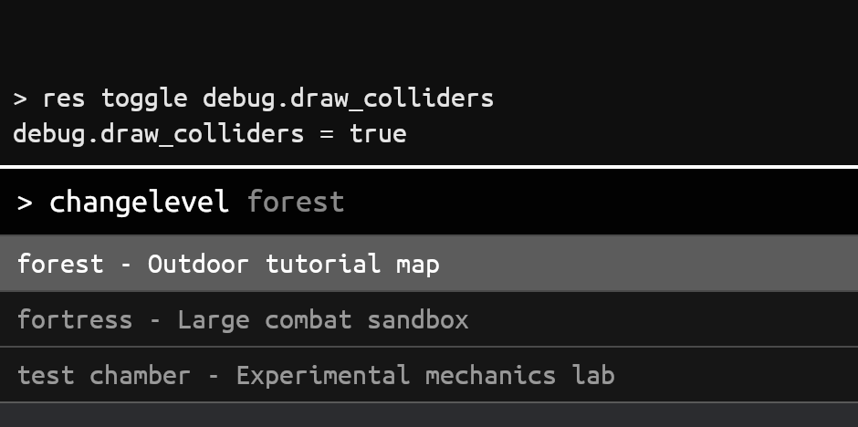

# chill_bevy_console

[](https://crates.io/crates/chill_bevy_console)

A configurable developer console plugin for [Bevy](https://bevyengine.org) games.

Press `` ` `` (backtick) to toggle the console open and closed.



## Version

| `chill_bevy_console` | `bevy` |
|---------------------------|--------|
| `0.4`                     | `0.19` |
| `0.3`                     | `0.19` |
| `0.2`                     | `0.19` |
| `0.1`                     | `0.18` |

## Install

```toml
[dependencies]
chill_bevy_console = "0.4"
```

Optional features:

- `embedded-font` — compile in and use the bundled Ubuntu Mono font.
- `persistent-history` — save and restore a plain-text console input/output
  transcript between runs.

## Usage

```rust
use bevy::prelude::*;
use chill_bevy_console::{ChillConsole, ConsoleAppExt, CommandArgs, ConsoleCommand, console_closed};

fn main() {
    App::new()
        .add_plugins(DefaultPlugins)
        .add_plugins(ChillConsole::default())
        .add_console_command(
            ConsoleCommand::new("say", "say <text> - echo text", say_cmd),
        )
        .add_systems(Update, gameplay_input.run_if(console_closed))
        .run();
}

fn say_cmd(In(args): CommandArgs) -> String {
    args.join(" ")
}

fn gameplay_input() { /* movement, jump, etc. */ }
```

## `ConsoleAppExt` methods

Import `ConsoleAppExt` to add these methods to Bevy's `App`. Each returns
`&mut App`, so calls can be chained.

| Method | Purpose |
|--------|---------|
| `add_console_command(command)` | Register a `ConsoleCommand` with aliases, argument metadata, structured help, and optional dynamic completion. |
| `add_console_resource::<R>()` | Register `R`'s supported reflected fields for the built-in `res` command. |
| `add_console_state::<S>()` | Register a reflected Bevy state for the built-in `state` command. |

See [USAGE.md](USAGE.md) for adding commands, custom config, persisting history, blocking gameplay input, and built-in commands. Runnable examples live in [`examples/`](examples) — try `cargo run --example basic`.

For resource-backed properties, rich command metadata, and a dynamic argument
completer, run `cargo run --example advanced`.

For output written by ordinary game systems, run
`cargo run --example system_output`.

For reflected Bevy state inspection and transitions, run
`cargo run --example states`.

Commands stay simple by default. When a command needs richer help or argument
completion, use a `ConsoleCommand` builder:

```rust
app.add_console_command(
    ConsoleCommand::new("map", "map <name> - load a map", load_map)
        .with_args([ArgumentSpec::new("name")])
        .with_completions(complete_map_names),
);
```

## License

MIT OR Apache-2.0
